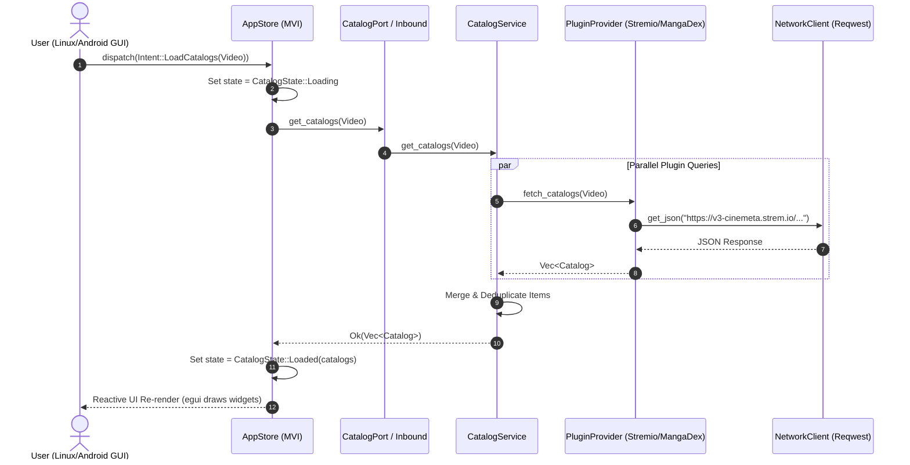

# River Architecture & Diagram Specification

This document provides visual architectural diagrams and layer contracts for River—an ultra plugin-focused, 100% pure Rust media aggregator.

---

## 1. Hexagonal & MVI System Overview

```mermaid
graph TD
    subgraph Layer 8: GUI & CLI Presentation Drivers
        CLI[river-cli<br>Terminal Runner]
        GUI[river-app<br>Linux & Android Window]
    end

    subgraph Layer 5: MVI State Engine
        Store[AppStore<br>State Machine]
        State[AppState<br>Immutable Snapshots]
        Intent[Intent<br>User Actions]
    end

    subgraph Layer 3: Use Cases & Services
        CatSvc[CatalogService<br>Parallel Aggregation]
        LibSvc[LibraryService<br>Persistence & Progress]
        PlugSvc[PluginService<br>Lifecycle & Priority]
    end

    subgraph Layer 2: Hexagonal Ports
        InPorts[Inbound Ports<br>CatalogPort, LibraryPort, PluginPort]
        OutPorts[Outbound Ports<br>PluginProvider, StorageRepository, NetworkClient]
    end

    subgraph Layer 1: Domain Core
        Core[river-core<br>MediaItem, Catalog, Stream, Chapter, Error]
    end

    subgraph Layer 4: Infrastructure Adapters
        Stremio[plugin-stremio<br>Stremio Cinemeta API]
        MangaDex[plugin-mangadex<br>MangaDex REST API]
        Jamendo[plugin-jamendo<br>Music Streams]
        RSS[plugin-rss<br>Podcast Feeds]
        SQLite[storage-sqlite<br>Bundled SQLite DB]
        Reqwest[network-reqwest<br>Async HTTP Client]
    end

    CLI --> Intent
    GUI --> Intent
    Intent --> Store
    Store --> State
    State --> CLI
    State --> GUI

    Store --> InPorts
    InPorts --> CatSvc
    InPorts --> LibSvc
    InPorts --> PlugSvc

    CatSvc --> Core
    LibSvc --> Core
    PlugSvc --> Core

    CatSvc --> OutPorts
    LibSvc --> OutPorts
    PlugSvc --> OutPorts

    OutPorts <|.. Stremio
    OutPorts <|.. MangaDex
    OutPorts <|.. Jamendo
    OutPorts <|.. RSS
    OutPorts <|.. SQLite
    OutPorts <|.. Reqwest

    Stremio --> Reqwest
    MangaDex --> Reqwest
    Jamendo --> Reqwest
    RSS --> Reqwest
```

---

## 2. Unidirectional MVI Data Flow



---

## 3. Layer Dependency Rules

1. **Inner layers never depend on outer layers**: `river-core` has zero dependencies on any other River crate.
2. **Ports decouple Core from Infrastructure**: `river-ports` depends only on `river-core`.
3. **Services implement Inbound Ports**: `river-services` depends on `river-core` and `river-ports`.
4. **Adapters implement Outbound Ports**: `river-adapters/*` depend on `river-core` and `river-ports`.
5. **Presentation manages State**: `river-presentation` depends on `river-core` and `river-ports`.
6. **Engine wires everything**: `river-engine` depends on all services, adapters, and presentation stores.
7. **Apps & CLIs are thin drivers**: `river-app` and `river-cli` depend only on `river-engine`, `river-presentation`, and `river-core`.
